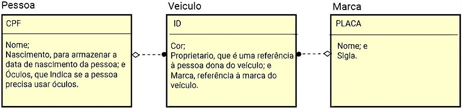
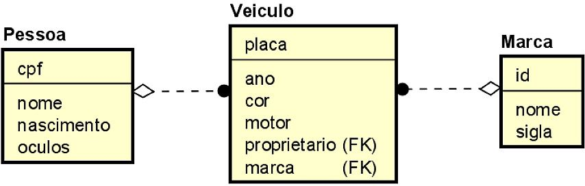

## Modelo ER Utilizado para criar tabelas

## Novo Modelo que inspirou as mudanças na tabela Veiculo

## Sobre a criação do script `eventos.py`

### Roteiro de prática

Você foi contratado como desenvolvedor de uma startup de tecnologia, a qual está
desenvolvendo um sistema de gerenciamento de eventos. A aplicação precisa armazenar
informações sobre eventos, participantes e locais. Para isso, você deve criar um
script em Python que se conecte a um banco de dados SQLite e crie as
tabelas necessárias.

### Objetivo

Desenvolver um script em Python que:

- Conecte-se a um banco de dados SQLite.
- Crie três tabelas: Eventos, Participantes e Locais.
- Selecione e exiba os dados armazenados.
